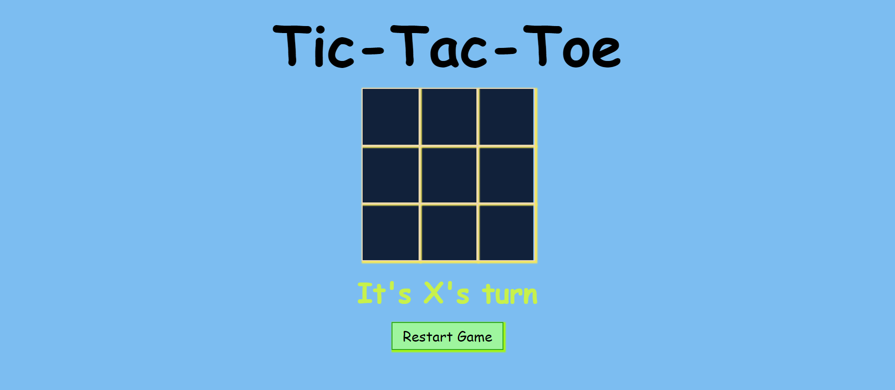

# Tic-Tac-Toe
## Introduction

Our Tic-Tac-Toe game website offers a captivating twist on the age-old classic. Engage in intense battles of wits with friends or rivals, all from the comfort of your device. Immerse yourself in a sleek, user-friendly interface, and experience the joy of victory or the agony of defeat in this timeless, two-player showdown.

## Preview

## Features

- Interactive and user-friendly interface
- Two player game
- Responsive design for optimal user experience on different devices

## Deployment

This app can be deployed in two ways:

1. Clone the repository and run the index.html file locally on your computer
2. Deploy the app on a web server and access it through a web browser

## Requirements

- A modern web browser such as Google Chrome, Mozilla Firefox, or Microsoft Edge
- Basic knowledge of HTML, CSS, and JavaScript

## How to Use

1. Clone the repository or download the files to your computer
2. Open the index.html file in a web browser